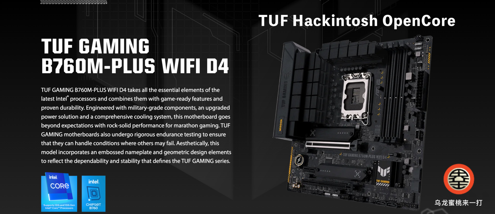

# [Asus TUF Gaming B760M Plus](https://github.com/hackintosh-club/TUF-B760M-Plus-OpenCore) Hackintosh OpenCore EFI

### [简体中文](https://github.com/hackintosh-efi/MAG-B660M-MORTAR-WIFI-DDR4-OpenCore)

[OpenCore 1.0.0](https://github.com/acidanthera/OpenCorePkg)

### OS Version Tested

- macOS Sonoma 14.x
- macOS Ventura 13.6
- macOS Monterey 12.x

### Hardware

- Motherboard: Asus TUF Gaming B760M-Plus WiFi D4
- Bios Version: 1402（2023/09/11）
- CPU: Intel 13th i5-13500
- RAM: KingBank 2x16GB DDR4 3200MHz
- GPU:Sapphire Radeon RX 570 8GB 2304SP
- Audio: Realtek ALC897
- Ethernet: Realtek 2.5GbE Family Controller
- Wireless: Intel WiFi

### Bios Setup

| Name               | Option   |      | Name          | Option   |
| ------------------ | -------- | ---- | ------------- | -------- |
| VT-d               | Enabled  |      | XHCI-Hand-Off | Enabled  |
| Above 4G Decoding  | Enabled  |      | Fast Boot     | Disabled |
| CSM                | Disabled |      | Secure Boot   | Disabled |
| Resize Bar Support | Disabled |      |               |          |

### Notes

- Use [OCAuxiliaryTools](https://github.com/ic005k/OCAuxiliaryTools/releases) build your SMBIOS
- If you want to use a CPU without Efficient-Core, you must uncheck the option in the config.plist file Kernel--ProvideCurrentCpuinfo
- Intel WiFi driver [AirportItlwm.kext](https://github.com/OpenIntelWireless/itlwm/releases) in this EFI is only applicable to MacOS 14.4 Sonoma. Please download and replace this driver yourself when installing other MacOS versions

### Contact Us

- QQ Group: 23304408

